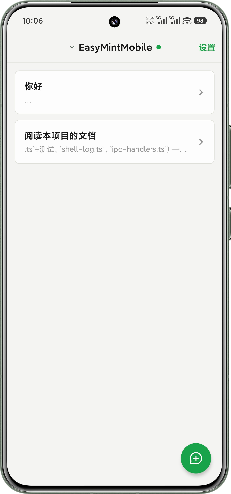
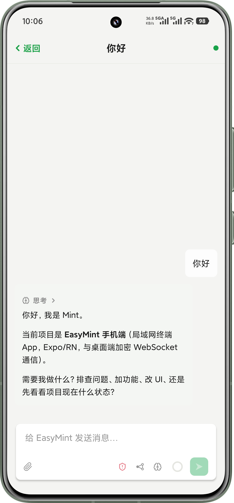

# EasyMint Mobile

EasyMint 的 **Android / iOS 客户端**——把手机当成桌面端的局域网终端：扫二维码与电脑配对后，用加密 WebSocket 实时操作电脑当前打开的项目和会话。

桌面端（Electron）在这里：[**tianemon/EasyMint**](https://github.com/tianemon/EasyMint)。手机端不能单独使用，需要与同一局域网内的桌面端配对。

| 会话列表 | 会话内实时操作 |
|---|---|
|  |  |

## 能做什么

- **扫码配对**：桌面端「设备互联 → 手机终端」生成二维码，手机扫码并核对六位数字，再在电脑上确认
- **会话操作**：打开项目、切换会话、发消息；任务运行中还能继续插话引导，随时中止
- **过程可见**：模型的思考、工具调用与执行输出实时呈现；后台命令与子 Agent 委派进度可查看、可停止
- **互动**：桌面端向你提问时可直接在手机上作答
- **附件**：随消息发送图片（走系统相册）与文档（走系统文件选择器）；单文件与单次总量上限 15 MB、单次最多 10 个
- **输入卡控制项**：会话内切换权限模式（只读 / 标准 / 完全访问）、模型与思考等级，并查看上下文占用
- **会话管理**：重命名、置顶、归档与恢复

## 安装

- **Android**：到 [Releases](https://github.com/tianemon/EasyMintMobile/releases) 下载 `EasyMint-v*.apk` 安装即可（只构建 arm64-v8a，现代手机都支持）
- **iOS**：需要有 Apple 签名才能装到真机，暂未提供现成安装包；仓库里有本地打包脚本（见下），免费 Apple ID 签出的包 7 天有效

装好后：桌面端启动 EasyMint →「设备互联 → 手机终端」生成二维码 → 手机扫码并核对六位数字 → 在电脑上确认配对。

## 开发

```bash
npm install
npm run check          # tsc --noEmit + expo-doctor

npm run apk            # 打 Android APK → apk/EasyMint-<时间戳>.apk（只编 arm64-v8a，自动清理旧包）
npm run ios            # 编 Release 并安装到已连接的 iPhone（需先在 Xcode 里登录 Apple ID）
npm run ipa            # 出已签名 IPA；`npm run ipa -- --unsigned` 出未签名 IPA（给 Sideloadly 重签用）
```

首次原生构建后，可用 `npm start` 启动 Metro。开发期要 debug + Metro 时用 `npx expo run:ios` / `npx expo run:android`。

推 `v*` tag 会触发 CI 构建 Android APK 并发布到 Releases（`.github/workflows/release.yml`）；分支 push 与 PR 跑类型检查门禁（`.github/workflows/ci.yml`）。

项目使用 Expo SDK 57 Development Build；相机、相册、SecureStore 与局域网权限由 `app.json` 配置。

## 数据边界

手机只在系统 SecureStore/Keychain 中保存 PC 标识、局域网地址、设备标识和配对共享密钥。项目、会话、消息、模型配置与实时输出只保存在运行内存中，App 不把这些业务数据写入文件、数据库或异步缓存。

通信使用 P-256 ECDH、HKDF-SHA256 和 AES-256-GCM。PC 只允许访问 EasyMint 窗口中当前打开的项目，并且不会向手机发送项目绝对路径或 API 密钥。
